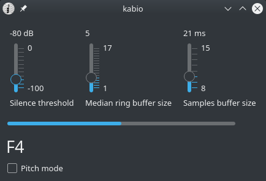

# Kabio

Kabio is a program that recognizes notes from a signal
and sends these to other program with MIDI in real time.
This works with JACK Audio Connection Kit.

This program uses Qt5 for GUI and [aubio](https://aubio.org/) for recognition.

## Feautures

* Monophonic note recognition
* Pitch bend
* JACK MIDI communication

## Install

Download latest release build from Releases tab.

If you have Debain or Ubuntu distro run `apt install [path of downloaded deb package]`.
Else try download TGZ package, extract this and run executable `kabio`.

If these tryings didn't help you, please build package yourself following below manual.

## Building

1. Install dependencies:
    * C++ compiler
    * Qt5
    * Aubio
    * CMake
    * JACK
2. Make `build` directory, go there and run `cmake ..`
3. Run `make`
----------------------
4. If you wish install run `make install` as root user.

To build distro package go to `build/` directory and run `cpack -G [your package type]`. The built package
will be in `_packages/`.

## Contacts

George Bartolomey

* Email: george+dev@bh4.ru
* Telegram: @georgeBartolomey
* linux.org.ru: @realBarmaley
